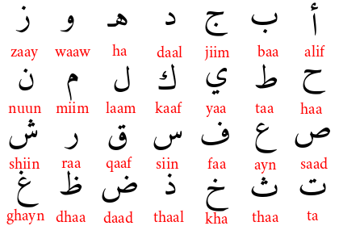

# arabicletterMNIST
MNIST dataset of hand-drawn arabic isolated letters 

from **alif** to **yaa**. each letter is ( 28  * 28 == 784 ) + 1 pixels.
The first column is the "label" , The rest of the columns contain the pixel-values of the associated image.




## كن جزءا 
### draw with us :smirk:
```bash

$ git clone https://github.com/151ali/arabicletterMNIST.git
$ cd arabicletterMNIST
$ node app.js
